# BlackBox Farm

**Advanced DeFi trading infrastructure for Solana — democratizing access to sophisticated trading tools, holder analytics, and community-powered campaigns**

_Built by the BlackBox team — bringing institutional-grade tools to retail traders_

[🌐 Live Platform](https://blackbox.farm) · [𝕏 BlackBoxFarm](https://x.com/blackboxfarm) · [📊 Token Analytics](https://blackbox.farm/holders) · [🤖 Trading Bots](https://blackbox.farm/blackbox)

[](#)
[](#)
[](#)

---

## ✨ What is BlackBox Farm?

BlackBox Farm is an all-in-one DeFi trading platform purpose-built for the Solana ecosystem. We provide the tools that were once reserved for whales and insiders — now accessible to everyone.

> 💡 **Why BlackBox?** While others give you charts, we give you **actionable intelligence**. Real-time holder analysis, automated trading execution, and community coordination tools that actually move the needle.

### 🎯 Our Mission

The DeFi space is full of noise. Rugs. Scams. Insider dumps. We're building the infrastructure to:

- **Expose bad actors** — Our holder analytics identify bundled wallets, dev dumps, and coordinated insider activity
- **Automate execution** — Stop watching charts 24/7. Let our bots handle the execution while you focus on strategy  
- **Unite communities** — Pool resources for coordinated campaigns that benefit everyone, not just whales

---

## 🚀 Core Features

| Feature | Status | Description |
|---------|--------|-------------|
| **Token Holder Analytics** | ✅ Released | Deep-dive analysis of any Solana token's holder distribution, whale detection, and health scoring |
| **BumpBot Campaigns** | ✅ Released | Automated volume generation with customizable parameters and multi-wallet support |
| **Copy Trading** | ✅ Released | Mirror successful wallets with configurable position sizing and risk controls |
| **Community Campaigns** | ✅ Released | Crowdfunded trading campaigns with transparent execution and profit sharing |
| **Wallet Management** | ✅ Released | Secure encrypted wallet storage with bulk operations and balance tracking |
| **Dev Reputation System** | ✅ Released | Historical analysis of token creators to identify serial ruggers |
| **Fantasy Trading** | 🔜 Coming Soon | Paper trading mode to test strategies without risking capital |
| **Advanced Arbitrage** | 🔜 Coming Soon | Cross-DEX arbitrage detection and automated execution |

---

## 📊 Token Analytics Deep Dive

Our `/holders` page provides institutional-grade token analysis:

```
┌─────────────────────────────────────────────────────────────┐
│  🔍 HOLDER ANALYSIS                                         │
├─────────────────────────────────────────────────────────────┤
│  • Total Wallets vs Real Holders (dust filtering)          │
│  • Top 10/20/50 Concentration Metrics                      │
│  • Bundled Wallet Detection                                │
│  • Dev/Insider Activity Tracking                           │
│  • Historical Holder Trends                                │
│  • AI-Generated Share Cards                                │
│  • Health Grade Scoring (A+ to F)                          │
└─────────────────────────────────────────────────────────────┘
```

---

## 🛠️ Tech Stack

<table>
<tr>
<td align="center" width="120">

<br><strong>React 18</strong>
</td>
<td align="center" width="120">

<br><strong>TypeScript</strong>
</td>
<td align="center" width="120">

<br><strong>Tailwind CSS</strong>
</td>
<td align="center" width="120">

<br><strong>Vite</strong>
</td>
</tr>
<tr>
<td align="center" width="120">

<br><strong>Supabase</strong>
</td>
<td align="center" width="120">

<br><strong>Solana</strong>
</td>
<td align="center" width="120">

<br><strong>Helius RPC</strong>
</td>
<td align="center" width="120">

<br><strong>shadcn/ui</strong>
</td>
</tr>
</table>

---

## 🏗️ Architecture

```mermaid
graph TB
    subgraph Frontend["🖥️ Frontend (React + Vite)"]
        UI[BlackBox UI]
        Holders[Holder Analytics]
        Bots[Trading Bots]
        Community[Community Hub]
    end
    
    subgraph Backend["⚡ Backend (Supabase Edge Functions)"]
        API[API Layer]
        Auth[Authentication]
        Crypto[Wallet Encryption]
    end
    
    subgraph Data["📊 Data Sources"]
        Helius[Helius RPC]
        Jupiter[Jupiter API]
        DexScreener[DexScreener]
        PumpFun[Pump.fun]
    end
    
    subgraph Storage["💾 Storage (Supabase)"]
        DB[(PostgreSQL)]
        Secrets[Encrypted Secrets]
    end
    
    UI --> API
    Holders --> Helius
    Bots --> Jupiter
    API --> DB
    Auth --> Secrets
```



---

## 📁 Project Structure

```
blackboxfarm/
├── src/
│   ├── components/          # React components
│   │   ├── blackbox/        # Trading bot components
│   │   ├── holders/         # Token analytics components
│   │   ├── community/       # Community campaign components
│   │   └── ui/              # Shared UI components (shadcn)
│   ├── hooks/               # Custom React hooks
│   ├── pages/               # Route pages
│   ├── lib/                 # Utilities and helpers
│   └── integrations/        # Supabase client & types
├── supabase/
│   ├── functions/           # Edge functions
│   └── migrations/          # Database migrations
├── public/                  # Static assets
└── index.html              # Entry point
```

---

## 🔐 Security

Security is paramount when dealing with wallets and trading:

| Feature | Implementation |
|---------|---------------|
| **Wallet Encryption** | AES-256-GCM encryption for all stored private keys |
| **Row Level Security** | PostgreSQL RLS policies ensuring data isolation |
| **2FA Support** | TOTP-based two-factor authentication |
| **Rate Limiting** | API rate limiting on all edge functions |
| **Audit Logging** | Comprehensive activity logging for all operations |

> ⚠️ **Note:** This is proprietary software. The codebase is visible for transparency but not licensed for redistribution or commercial use.

---

## 🤝 Integrations

| Partner | Integration |
|---------|-------------|
| **Helius** | Primary RPC provider for Solana data |
| **Jupiter** | DEX aggregation for optimal swap execution |
| **DexScreener** | Real-time price and chart data |
| **Pump.fun** | Bonding curve token detection and analytics |
| **Supabase** | Backend infrastructure and authentication |

---

## 📈 Platform Stats

| Metric | Value |
|--------|-------|
| **Tokens Analyzed** | 50,000+ |
| **Active Campaigns** | 200+ |
| **Total Volume Tracked** | $10M+ |
| **Uptime** | 99.9% |

---

## 🚀 Getting Started

Visit [blackbox.farm](https://blackbox.farm) to access the platform.

For development:

```bash
# Clone the repository
git clone https://github.com/systemreset-ca/blackboxfarm.git

# Install dependencies
npm install

# Start development server
npm run dev
```

---

## 📬 Contact

- **Website:** [blackbox.farm](https://blackbox.farm)
- **Twitter/X:** [@blackboxfarm](https://x.com/blackboxfarm)
- **Email:** contact@blackbox.farm

---

<p align="center">
  <strong>Built with 🖤 for the Solana community</strong>
</p>

<p align="center">
  <sub>© 2024 BlackBox Farm. All rights reserved.</sub>
</p>
